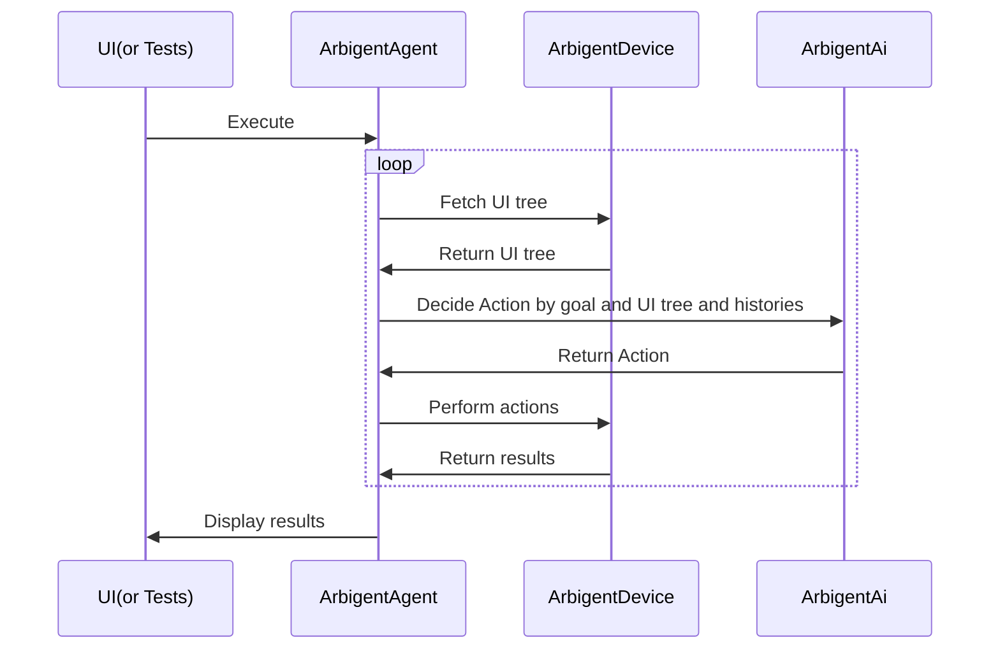
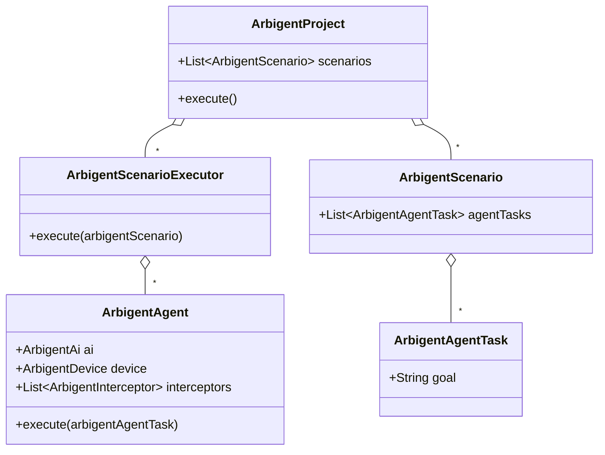

# Arbigent(Arbiter-Agent): An AI Agent Testing Framework for Modern Applications


**Zero to AI agent testing in minutes. Arbigent's intuitive UI and powerful code interface make it accessible to everyone, while its scenario breakdown feature ensures scalability for even the most complex tasks.**

> [!WARNING]
> There seems to be a spam account posing as Arbigent, but the account is not related to me. The creator's accounts are [`https://x.com/_takahirom_`](https://x.com/_takahirom_) and [`https://x.com/new_runnable`](https://x.com/new_runnable) .

## Screenshot


## Demo movie

https://github.com/user-attachments/assets/ec582760-5d6a-4ee3-8067-87cb2b673c8d

## Motivation

### Make AI Agent Testing Practical for Modern Applications

Traditional UI testing often relies on brittle methods that are easily disrupted by even minor UI changes. A/B tests, updated tutorials, unexpected dialogs, dynamic advertising, or ever-changing user-generated content can cause tests to fail.  
AI agents emerged as a solution, but testing with AI agents also presents challenges. AI agents often don't work as intended; for example, the agents might open other apps or click on the wrong button due to the complexity of the task.  
To address these challenges, I created Arbigent, an AI agent testing framework that can break down complex tasks into smaller, dependent scenarios. By decomposing tasks, Arbigent enables more predictable and scalable testing of AI agents in modern applications.

### Customizable for Various AI Providers, OSes, Form Factors, etc.

I believe many AI Agent testing frameworks will emerge in the future. However, widespread adoption might be delayed due to limitations in customization. For instance:

*   **Limited AI Provider Support:** Frameworks might be locked to specific AI providers, excluding those used internally by companies.
*   **Slow OS Adoption:** Support for different operating systems (like iOS and Android) could lag.
*   **Delayed Form Factor Support:** Expanding to form factors beyond phones, such as Android TV, might take considerable time.

To address these issues, I aimed to create a framework that empowers users with extensive customization capabilities. Inspired by [OkHttp's interceptor](https://square.github.io/okhttp/features/interceptors/) pattern, Arbigent provides interfaces for flexible customization, allowing users to adapt the framework to their specific needs, such as those listed above.

### Easy Integration into Development Workflows

Furthermore, I wanted to make Arbigent accessible to QA engineers by offering a user-friendly UI. This allows for scenario creation within the UI and seamless test execution via the code interface.

##  Key Feature Breakdown

**I. Core Functionality & Design**

*   **Complex Task Management:**
    *   **Scenario Dependencies:** Breaks down complex goals into smaller, manageable scenarios that depend on each other (e.g., login -> search).
    *   **Orchestration:** Acts as a mediator, managing the execution flow of AI agents across multiple, interconnected scenarios.
*   **Hybrid Development Workflow:**
    *   **UI-Driven Scenario Creation:**  Allows non-programmers (e.g., QA engineers) to visually design test scenarios through a user-friendly interface.
    *   **Code-Based Execution:** Enables software engineers to execute the saved scenarios programmatically (YAML files), allowing for integration with existing testing infrastructure.

**II. Cross-Platform & Device Support**

*   **Multi-Platform Compatibility:**
    *   **Mobile & TV:** Supports testing on iOS, Android, Web, and TV interfaces.
    *   **D-Pad Navigation:**  Handles TV interfaces that rely on D-pad navigation.

**III. AI Optimization & Efficiency**

*   **Enhanced AI Understanding:**
    *   **UI Tree Optimization:** Simplifies and filters the UI tree to improve AI comprehension and performance.
    *   **Accessibility-Independent:** Provides annotated screenshots to assist AI in understanding UIs that lack accessibility information.
*   **Cost Savings:**
    *   **Open Source:** Free to use, modify, and distribute, eliminating licensing costs.
  *   **Efficient Model Usage:** Defaults to `gpt-4.1` for improved capabilities; also supports cost-effective models like `gpt-4o-mini`.

**IV. Robustness & Reliability**

*   **Double Check with AI-Powered Image Assertion:** Integrates [Roborazzi's feature](https://takahirom.github.io/roborazzi/ai-powered-image-assertion.html#behavior-of-ai-powered-image-assertion) to verify AI decisions using image-based prompts and allows the AI to re-evaluate if needed.
*   **Stuck Screen Detection:** Identifies and recovers from situations where the AI agent gets stuck on the same screen, prompting it to reconsider its actions.

**V. Advanced Features & Customization**

*   **Flexible Code Interface:**
    *   **Custom Hooks:** Offers a code interface for adding custom initialization and cleanup methods, providing greater control over scenario execution.
*   **Maestro YAML Integration:**
    *   **Pre-defined Test Flows:** Execute existing Maestro YAML test flows as initialization methods within Arbigent scenarios.
    *   **Reusable Test Components:** Leverage your existing Maestro test automation scripts to set up complex application states before AI agent testing.
    *   **Example Use Cases:**
        * Run login flows using Maestro YAML before AI agent testing
        * Set up specific application states (e.g., user onboarding completion)
        * Execute complex setup sequences that require precise timing
        * Integrate existing Maestro test assets into AI agent testing workflows
* **Model Context Protocol (MCP) Support:**
    * Introduced initial support for MCP, enabling Arbigent to leverage external tools and services defined via MCP servers. This significantly extends testing capabilities beyond direct UI interaction.
    * You can configure MCP servers using a JSON string in the Project Settings.
    * **Example MCP Use Cases:**
        * Install and launch applications
        * Check server logs (e.g., user behavior) using external tools
        * Retrieve debug logs
        * Interact with various other custom tools and services
    * **MCP Server Control:**
        * **Project-level defaults:** Use the `enabled` field in MCP JSON to disable servers by default:
          ```json
          {
            "mcpServers": {
              "filesystem": { "command": "npx", "args": ["..."] },
              "github": { "command": "npx", "args": ["..."], "enabled": false }
            }
          }
          ```
        * **Scenario-level overrides:** Override project defaults per scenario using `mcpOptions`:
          ```yaml
          scenarios:
          - id: "my-scenario"
            goal: "Test with specific MCP servers"
            mcpOptions:
              mcpServerOptions:
                - name: "github"
                  enabled: true   # Override: enable for this scenario
                - name: "filesystem"
                  enabled: false  # Override: disable for this scenario
          ```
        * Servers without overrides use project defaults. If no `enabled` field exists, the server is enabled by default.
* **AI Hints - App-Provided Context:**
    * Apps can provide domain-specific hints to help the AI understand the current screen better.
    * Embed hints in the accessibility label using the `[[aihint:...]]` format:
      ```kotlin
      // Android (contentDescription)
      view.contentDescription = "Play button [[aihint:Video player, buffering]]"
      ```
      ```swift
      // iOS (accessibilityLabel)
      button.accessibilityLabel = "Play button [[aihint:Video player, buffering]]"
      ```
      ```html
      <!-- Web (aria-label) -->
      <button aria-label="Play button [[aihint:Video player, buffering]]">Play</button>
      ```
    * The `[[...]]` format allows hints to coexist with accessibility labels and supports structured data like JSON.
    * **Note:** Since this uses accessibility labels, it affects screen readers (TalkBack, VoiceOver, etc.). Enable hints only during testing to avoid accessibility issues in production.

**VI. Community & Open Source**

*   **Open Source Nature:**
    *   **Free & Open:** Freely available for use, modification, and distribution.
    *   **Community Driven:** Welcomes contributions from the community to enhance and expand the framework.

## Arbigent's Strengths and Weaknesses Based on [SMURF](https://testing.googleblog.com/2024/10/smurf-beyond-test-pyramid.html)

I categorized automated testing frameworks into five levels using the [SMURF](https://testing.googleblog.com/2024/10/smurf-beyond-test-pyramid.html) framework. Here's how Arbigent stacks up:

*   **Speed (1/5):** Arbigent's speed is currently limited by the underlying AI technology and the need to interact with the application's UI in real-time. This makes it slower than traditional unit or integration tests.  
    * We have introduced some mechanisms to address this:
       *  Tests can be parallelized using the **`--shard` option** to speed up execution.  
       *  **AI result caching** can be utilized when the UI tree and goal are identical, which is configurable in the project settings.  
*   **Maintainability (4/5):** Arbigent excels in maintainability. The underlying AI model can adapt to minor UI changes, minimizing the need to rewrite tests for every small update, thus reducing maintenance effort. You can write tests in natural language (e.g., "Complete the tutorial"), making them resilient to UI changes. The task decomposition feature also reduces duplication, further enhancing maintainability. Maintenance can be done by non-engineers, thanks to the natural language interface.
*   **Utilization (1/5):** Arbigent requires both device resources (emulators or physical devices) and AI resources, which can be costly. (AI cost can be around $0.005 per step and $0.02 per task when using GPT-4o.)
*   **Reliability (3/5):** Arbigent has several features to improve reliability. It automatically waits during loading screens, handles unexpected dialogs, and even attempts self-correction. However, external factors like emulator flakiness can still impact reliability.
    *   Recently I found Arbigent has retry feature and can execute the scenario from the beginning. But, **even without retry, Arbigent works fine without failures thanks to the flexibility of AI.**
*   **Fidelity (5/5):** Arbigent provides high fidelity by testing on real or emulated devices with the actual application. It can even assess aspects that were previously difficult to test, such as verifying video playback by checking for visual changes on the screen.

I believe that many of its current limitations, such as speed, maintainability, utilization, and reliability, will be addressed as AI technology continues to evolve. The need for extensive prompt engineering will likely diminish as AI models become more capable.

## How to Use

### Installation

Install the Arbigent UI binary from the [Release page](https://github.com/takahirom/arbigent/releases).


### Installation for macOS Users

If you encounter security warnings when opening the app:
Refer to [Apple's guide on opening apps from unidentified developers](https://support.apple.com/guide/mac-help/open-a-mac-app-from-an-unknown-developer-mh40616/mac).


This `Open Anyway` button is available for about an hour after you try to open the app.


### Device Connection and AI API Key Entry

1. Connect your device to your PC.
2. In the Arbigent UI, select your connected device from the list of available devices. This will establish a connection.
3. Enter your AI provider's API key in the designated field within the Arbigent UI.


### Scenario Creation

Use the intuitive UI to define scenarios. Simply specify the desired goal for the AI agent.


### Generate scenarios

You can also generate scenarios from existing test cases. 


### Maestro YAML Integration

Arbigent allows you to integrate existing Maestro YAML test flows as initialization methods:

1. **Add to Initialization Methods**: Select "Maestro YAML" as an initialization method type in your scenario configuration


2. **Add Maestro YAML**: Write a Maestro YAML file that defines the steps to be executed before the AI agent starts its task


3. **Choose Scenario**: Select from your predefined Maestro YAML scenarios to run before AI agent execution


This enables you to:
- Set up complex application states using deterministic Maestro flows
- Reuse existing Maestro test automation assets
- Combine precise setup sequences with AI-driven testing

### Test Execution

Run tests either directly through the UI or programmatically via the code interface or CLI.

### CLI

You can install the CLI via Homebrew and run a saved YAML file.


```bash
brew tap takahirom/homebrew-repo
brew install takahirom/repo/arbigent
```

```
Usage: arbigent [<options>] <command> [<args>]...

Options:
  -h, --help   Show this message and exit

Commands:
  run        Execute test scenarios
  scenarios  List available scenarios
  tags       Manage scenario tags
```

#### Configuration with Settings Files

Arbigent supports configuration via settings files in the `.arbigent` directory, which simplifies CLI usage by eliminating the need to specify common parameters repeatedly. Create a `.arbigent` directory in your project root and place your configuration files inside.

Arbigent supports multiple configuration files with automatic priority ordering - local configuration files have higher priority than global ones, allowing you to maintain separate settings for different environments while providing appropriate fallbacks.

**Prioritized Configuration Support:**

Arbigent supports both global and command-specific configurations with prioritization:

1. **High Priority**: Command-specific settings (e.g., `run.ai-type`)
2. **Low Priority**: Global settings (e.g., `ai-type`) - used as fallback

**Example hybrid configuration:**
```yaml
# Global settings (shared across all commands)
project-file: tests/arbigent-project.yml
working-directory: /path/to/your/project
log-level: info

# Default AI configuration (fallback)
ai-type: openai
openai-api-key: sk-xxxxxxxxxxxxxxxxxx
openai-model-name: gpt-4.1

# Run command specific settings (overrides global settings)
run:
  ai-type: azureopenai  # Overrides global ai-type
  azure-openai-endpoint: https://xxxxxxxxx.openai.azure.com/openai/deployments/xxxxx/
  azure-openai-api-version: 2025-xx-xx
  azure-openai-model-name: gpt-4o
  azure-openai-api-key: xxxxxxxxxxxxxxxxxx
  os: android
```

**Simple flat configuration (still supported):**
```yaml
ai-type: azureopenai
azure-openai-endpoint: https://xxxxxxxxx.openai.azure.com/openai/deployments/xxxxx/
azure-openai-api-version: 2025-xx-xx
azure-openai-model-name: gpt-4o
azure-openai-api-key: xxxxxxxxxxxxxxxxxx
project-file: tests/arbigent-project.yml
os: android
log-level: info
working-directory: /path/to/your/project
```

When using a settings file, you can run tests with the simplified command:

```bash
arbigent run
```

All parameters configured in the settings files will be shown as `(source: already provided by property file)` in the help output, indicating which settings are already configured.

#### arbigent run command

```
Usage: arbigent run [<options>]

Options for OpenAI API AI:
  --openai-endpoint=<text>    Endpoint URL (default: https://api.openai.com/v1/)
  --openai-model-name=<text>  Model name (default: gpt-4.1)  
  --openai-api-key, --openai-key=<text> API key

Options for Gemini API AI:
  --gemini-endpoint=<text>    Endpoint URL (default: https://generativelanguage.googleapis.com/v1beta/openai/)
  --gemini-model-name=<text>  Model name (default: gemini-1.5-flash)
  --gemini-api-key=<text>     API key

Options for Azure OpenAI:
  --azure-openai-endpoint=<text>         Endpoint URL
  --azure-openai-api-version=<text>      API version
  --azure-openai-model-name=<text>       Model name (default: gpt-4.1)  
  --azure-openai-api-key, --azure-openai-key=<text> API key

Options:
  --ai-type=(openai|gemini|azureopenai)  Type of AI to use
  --ai-api-logging                       Enable AI API debug logging
  --os=(android|ios|web)                 Target operating system
  --project-file=<text>                  Path to the project YAML file
  --log-level=(debug|info|warn|error)    Log level
  --log-file=<text>                      Log file path
  --working-directory=<text>             Working directory for the project
  --path=<text>                          Path to a file
  --scenario-ids=<text>                  Scenario IDs to execute (comma-separated)
  --tags=<text>                          Tags to filter scenarios (comma-separated)
  --dry-run                              Dry run mode
  --shard=<value>                        Shard specification (e.g., 1/5)
  -h, --help                             Show this message and exit
```

When parameters are provided via the settings files, the help output will indicate `(source: already provided by property file)` for those options, so you know which parameters are already configured.

#### Other commands

**List scenarios:**
```bash
arbigent scenarios
```

**Manage tags:**
```bash
arbigent tags
```


### Shard Option to Enable Parallel Tests

You can run tests separately with the `--shard` option. This allows you to split your test suite and run tests in parallel, reducing overall test execution time.

**Example:**

```bash
arbigent run --shard=1/4
```

This command will run the first quarter of your test suite.

#### Running Specific Scenarios

You can run specific scenarios by their IDs:

```bash
arbigent run --scenario-ids="scenario-1,scenario-2"
```

Or filter scenarios by tags:

```bash
arbigent run --tags="smoke,regression"
```

**Integrating with GitHub Actions:**

Here's an example of how to integrate the `--shard` option with GitHub Actions to run parallel tests on multiple Android emulators:

```yaml
  cli-e2e-android:
    runs-on: ubuntu-latest
    strategy:
      fail-fast: false
      matrix:
        shardIndex: [ 1, 2, 3, 4 ]
        shardTotal: [ 4 ]
    steps:
...
      - name: CLI E2E test
        uses: reactivecircus/android-emulator-runner@v2
...
          script: |
            arbigent run --shard=${{ matrix.shardIndex }}/${{ matrix.shardTotal }} --os=android --project-file=sample-test/src/main/resources/projects/e2e-test-android.yaml --ai-type=gemini --gemini-model-name=gemini-2.0-flash-exp
...

      - uses: actions/upload-artifact@b4b15b8c7c6ac21ea08fcf65892d2ee8f75cf882 # v4
        if: ${{ always() }}
        with:
          name: cli-report-android-${{ matrix.shardIndex }}-${{ matrix.shardTotal }}
          path: |
            arbigent-result/*
          retention-days: 90
```

### Minimal GitHub Actions CI sample

You can use the CLI in GitHub Actions like in this sample. There are only two files: `.github/workflows/arbigent-test.yaml` and `arbigent-project.yaml`. This example demonstrates GitHub Actions and an `arbigent-project.yaml` file created by the Arbigent UI.

https://github.com/takahirom/arbigent-sample

## Supported AI Providers

| AI Provider | Supported |
|-------------|-----------|
| OpenAI      | Yes       |
| Gemini      | Yes       |
| OpenAI based APIs like Ollama | Yes |

You can add AI providers by implementing the `ArbigentAi` interface.

## Supported OSes / Form Factors

| OS          | Supported | Test Status in the Arbigent repository            |
|-------------|-----------|---------------------------------------------------|
| Android     | Yes       | End-to-End including Android emulator and real AI |
| iOS         | Yes       | End-to-End including iOS simulator and real AI    |
| Web(Chrome) | Yes       | Currently, Testing not yet conducted              |

You can add OSes by implementing the `ArbigentDevice` interface. Thanks to the excellent [Maestro](https://github.com/mobile-dev-inc/maestro) library, we are able to support multiple OSes.

| Form Factor    | Supported |
|----------------|-----------|
| Phone / Tablet | Yes       |
| TV(D-Pad)      | Yes       |

# Learn More

## Basic Structure

### Execution Flow

The execution flow involves the UI, Arbigent, ArbigentDevice, and ArbigentAi. The UI sends a project creation request to Arbigent, which fetches the UI tree from ArbigentDevice. ArbigentAi then decides on an action based on the goal and UI tree. The action is performed by ArbigentDevice, and the results are returned to the UI for display.



###  Class Diagram

The class diagram illustrates the relationships between ArbigentProject, ArbigentScenario, ArbigentTask, ArbigentAgent, ArbigentScenarioExecutor, ArbigentAi, ArbigentDevice, and ArbigentInterceptor.



### Saved project file

> [!WARNING]
> The yaml format is still under development and may change in the future.

The project file is saved in YAML format and contains scenarios with goals, initialization methods, and cleanup data. Dependencies between scenarios are also defined.
You can write a project file in YAML format by hand or create it using the Arbigent UI.

The id is auto-generated UUID by Arbigent UI but you can change it to any string.

#### Available Initialization Methods

- **Back**: Press the back button
- **Wait**: Wait for a specified duration
- **LaunchApp**: Launch an application
- **CleanupData**: Clear application data
- **OpenLink**: Open a URL/link
- **MaestroYaml**: Execute a predefined Maestro YAML scenario
- **Reconnect**: Disconnect and reconnect the device

```yaml
scenarios:
  - id: "7788d7f4-7276-4cb3-8e98-7d3ad1d1cd47"
    goal: "Open the Now in Android app from the app list. The goal is to view the list\
    \ of topics.  Do not interact with the app beyond this."
    initializationMethods:
      - type: "CleanupData"
        packageName: "com.google.samples.apps.nowinandroid"
      - type: "LaunchApp"
        packageName: "com.google.samples.apps.nowinandroid"
      - type: "MaestroYaml"
        scenarioId: "login-flow-maestro"
  - id: "f0ef0129-c764-443f-897d-fc4408e5952b"
    goal: "In the Now in Android app, select an tech topic and complete the form in\
    \ the \"For you\" tab. The goal is reached when articles are displayed.  Do not\
    \ click on any articles. If the browser opens, return to the app."
    dependency: "7788d7f4-7276-4cb3-8e98-7d3ad1d1cd47"
    imageAssertions:
      - assertionPrompt: "Articles are visible on the screen"
  - id: "73c785f7-0f45-4709-97b5-601b6803eb0d"
    goal: "Save an article using the Bookmark button."
    dependency: "f0ef0129-c764-443f-897d-fc4408e5952b"
  - id: "797514d2-fb04-4b92-9c07-09d46cd8f931"
    goal: "Check if a saved article appears in the Saved tab."
    dependency: "73c785f7-0f45-4709-97b5-601b6803eb0d"
    imageAssertions:
      - assertionPrompt: "The screen is showing Saved tab"
      - assertionPrompt: "There is an article in the screen"

# Maestro YAML scenarios for initialization
fixedScenarios:
  - id: "login-flow-maestro"
    title: "Login Flow"
    description: "Performs user login using predefined credentials"
    yamlText: |
      appId: com.google.samples.apps.nowinandroid
      ---
      - tapOn: "Sign In"
      - inputText: "test@example.com"
      - tapOn: "Password"
      - inputText: "password123"
      - tapOn: "Login"
      - assertVisible: "Welcome"
```

## Code Interface

> [!WARNING]
> The code interface is still under development and may change in the future.

Arbigent provides a code interface for executing tests programmatically. Here's an example of how to run a test:


### Dependency

Stay tuned for the release of Arbigent on Maven Central.

### Running saved project yaml file

You can load a project yaml file and execute it using the following code:

```kotlin
class ArbigentTest {
  private val scenarioFile = File(this::class.java.getResource("/projects/nowinandroidsample.yaml").toURI())

  @Test
  fun tests() = runTest(
    timeout = 10.minutes
  ) {
    val arbigentProject = ArbigentProject(
      file = scenarioFile,
      aiFactory = {
        OpenAIAi(
          apiKey = System.getenv("OPENAI_API_KEY")
        )
      },
      deviceFactory = {
        AvailableDevice.Android(
          dadb = Dadb.discover()!!
        ).connectToDevice()
      }
    )
    arbigentProject.execute()
  }
}
```

### Run a scenario directly

```kotlin
val agentConfig = AgentConfig {
  deviceFactory { FakeDevice() }
  ai(FakeAi())
}
val arbigentScenarioExecutor = ArbigentScenarioExecutor {
}
val arbigentScenario = ArbigentScenario(
  id = "id2",
  agentTasks = listOf(
    ArbigentAgentTask("id1", "Login in the app and see the home tab.", agentConfig),
    ArbigentAgentTask("id2", "Search an episode and open detail", agentConfig)
  ),
  maxStepCount = 10,
)
arbigentScenarioExecutor.execute(
  arbigentScenario
)
```

### Run a goal directly

```kotlin
val agentConfig = AgentConfig {
  deviceFactory { FakeDevice() }
  ai(FakeAi())
}

val task = ArbigentAgentTask("id1", "Login in the app and see the home tab.", agentConfig)
ArbigentAgent(agentConfig)
  .execute(task)
```
