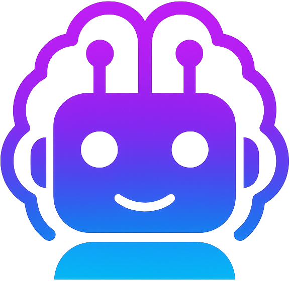

# 🤖 DroidMind 🧠

  

**Control Android devices with AI through the Model Context Protocol**

**DroidMind is your visionary copilot for Android mastery, bridging the gap between your AI assistant and Android devices.** It leverages the [Model Context Protocol (MCP)](https://modelcontextprotocol.io/) to unlock unparalleled control, debugging, and system analysis capabilities—all through natural language.

Imagine your AI assistant not just _talking_ about code, but actively participating in the development loop: building, testing, and debugging directly on your Android devices. DroidMind makes this a reality.

## 🌌 What is DroidMind?

DroidMind transforms how you interact with Android. It's a sophisticated server that securely exposes Android Debug Bridge (ADB) functionalities as MCP resources and tools. This allows AI assistants like Claude, Cursor, and other MCP-compatible clients to:

- **Directly Control Devices**: Execute commands, manage files, and automate UI interactions.
- **Analyze and Diagnose**: Retrieve logs, inspect device properties, and capture diagnostic information.
- **Streamline Workflows**: Integrate device interactions seamlessly into your AI-driven development process.

Whether you're an app developer, a ROM creator, or a system analyst, DroidMind empowers your AI assistant to become an active partner in your Android endeavors.

## 💡 Core Philosophy

DroidMind is built on the principles of:

- **AI-First Interaction**: Designed from the ground up to be primarily used through AI assistants. The focus is on natural language commands and AI-driven workflows.
- **Security and Control**: Robust security measures ensure that all operations are validated, and high-risk actions require explicit user confirmation. You are always in control.
- **Extensibility**: While powerful out-of-the-box, DroidMind's architecture is modular, ready for future enhancements.
- **Ease of Use**: Simplifies complex Android interactions into intuitive requests you can make to your AI.

## 🚀 Dive In

Ready to explore the future of AI-assisted Android development?

- **[Installation Guide](installation.md)**: Get DroidMind set up on your system.
- **[Docker Guide](docker.md)**: Run DroidMind in a containerized environment.
- **[Quick Start](quickstart.md)**: Connect DroidMind to your AI assistant and try your first commands.
- **[User Manual](user_manual/index.md)**: A deep dive into all of DroidMind's capabilities.
- **[MCP Reference](mcp-reference.md)**: Details on the specific MCP tools and resources DroidMind provides.

Let DroidMind revolutionize your Android workflow, making you faster, freer, and more brilliant! 🌠
