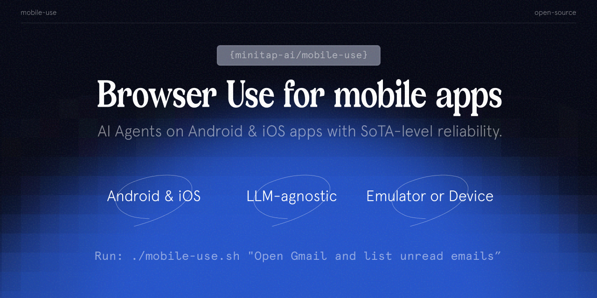
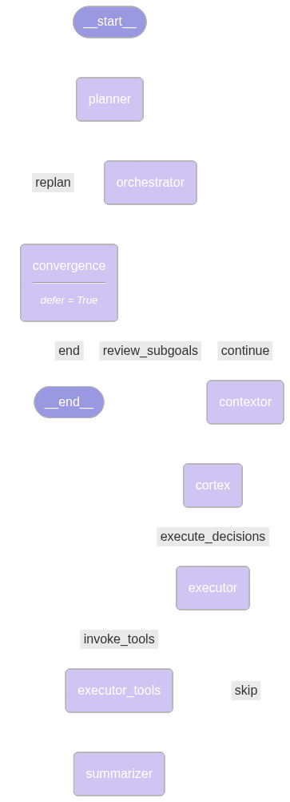

# mobile-use: automate your phone with natural language

<div align="center">



</div>

<div align="center">

[](https://discord.gg/6nSqmQ9pQs)
[](https://github.com/minitap-ai/mobile-use/stargazers)

<h3>
    <a href="https://platform.mobile-use.ai"><b>☁️ Cloud</b></a> •
    <a href="https://docs.minitap.ai/v2/mcp-server/introduction"><b>📚 Documentation</b></a>
</h3>
<p align="center">
    <a href="https://discord.gg/6nSqmQ9pQs"><b>Discord</b></a> •
    <a href="https://x.com/minitap_ai?t=iRWtI497UhRGLeCKYQekig&s=09"><b>Twitter / X</b></a>
</p>

[](https://pypi.org/project/minitap-mobile-use/)
[](https://www.python.org/downloads/)
[](https://github.com/minitap-ai/mobile-use/blob/main/LICENSE)

</div>

Mobile-use is a powerful, open-source AI agent that controls your Android or IOS device using natural language. It understands your commands and interacts with the UI to perform tasks, from sending messages to navigating complex apps.

> Mobile-use is quickly evolving. Your suggestions, ideas, and reported bugs will shape this project. Do not hesitate to join in the conversation on [Discord](https://discord.gg/6nSqmQ9pQs) or contribute directly, we will reply to everyone! ❤️

## ✨ Features

- 🗣️ **Natural Language Control**: Interact with your phone using your native language.
- 📱 **UI-Aware Automation**: Intelligently navigates through app interfaces (note: currently has limited effectiveness with games as they don't provide accessibility tree data).
- 📊 **Data Scraping**: Extract information from any app and structure it into your desired format (e.g., JSON) using a natural language description.
- 🔧 **Extensible & Customizable**: Easily configure different LLMs to power the agents that power mobile-use.

## Benchmarks

<p align="center">
  <a href="https://minitap.ai/benchmark">
    
  </a>
</p>

We stand as the top performers and the first to have completed 100% of the AndroidWorld benchmark.

Get more info about how we reached this milestone here: [Minitap Benchmark](https://minitap.ai/benchmark).

The official leaderboard is available [here](https://docs.google.com/spreadsheets/d/1cchzP9dlTZ3WXQTfYNhh3avxoLipqHN75v1Tb86uhHo/edit?pli=1&gid=0#gid=0).

## 🚀 Getting Started

Ready to automate your mobile experience? Follow these steps to get mobile-use up and running.

### 🌐 From our Platform

Easiest way to get started is to use our Platform.
Follow our [Platform quickstart](https://docs.minitap.ai/mobile-use-sdk/platform-quickstart) to get started.

### 🛠️ From source

1.  **Set up Environment Variables:**
    Copy the example `.env.example` file to `.env` and add your API keys.

    ```bash
    cp .env.example .env
    ```

2.  **(Optional) Customize LLM Configuration:**
    To use different models or providers, create your own LLM configuration file.

    ```bash
    cp llm-config.override.template.jsonc llm-config.override.jsonc
    ```

    Then, edit `llm-config.override.jsonc` to fit your needs.

    You can also use local LLMs or any other openai-api compatible providers :

    1. Set `OPENAI_BASE_URL` and `OPENAI_API_KEY` in your `.env`
    2. In your `llm-config.override.jsonc`, set `openai` as the provider for the agent nodes you want, and choose a model supported by your provider.

    > [!NOTE]
    > If you want to use Google Vertex AI, you must either:
    >
    > - Have credentials configured for your environment (gcloud, workload identity, etc…)
    > - Store the path to a service account JSON file as the GOOGLE_APPLICATION_CREDENTIALS environment variable
    >
    > More information: - [Credential types](https://cloud.google.com/docs/authentication/application-default-credentials#GAC) - [google.auth API reference](https://googleapis.dev/python/google-auth/latest/reference/google.auth.html#module-google.auth)

### Quick Launch (Docker)

> [!NOTE]
> This quickstart, is only available for Android devices/emulators as of now, and you must have Docker installed.

First:

- Either plug your Android device and enable USB-debugging via the Developer Options
- Or launch an Android emulator

Then run in your terminal:

1. For Linux/macOS:

```bash
chmod +x mobile-use.sh
bash ./mobile-use.sh \
  "Open Gmail, find first 3 unread emails, and list their sender and subject line" \
  --output-description "A JSON list of objects, each with 'sender' and 'subject' keys"
```

2. For Windows (inside a Powershell terminal):

```powershell
powershell.exe -ExecutionPolicy Bypass -File mobile-use.ps1 `
  "Open Gmail, find first 3 unread emails, and list their sender and subject line" `
  --output-description "A JSON list of objects, each with 'sender' and 'subject' keys"
```

> [!NOTE]
> If using your own device, make sure to accept the ADB-related connection requests that will pop up on your device.

#### 🧰 Troubleshooting

The script will try to connect to your device via IP.
Therefore, your device **must be connected to the same Wi-Fi network as your computer**.

##### 1. No device IP found

If the script fails with the following message:

```
Could not get device IP. Is a device connected via USB and on the same Wi-Fi network?
```

Then it couldn't find one of the common Wi-Fi interfaces on your device.
Therefore, you must determine what WLAN interface your phone is using via `adb shell ip addr show up`.
Then add the `--interface <YOUR_INTERFACE_NAME>` option to the script.

##### 2. Failed to connect to <DEVICE_IP>:5555 inside Docker

This is most probably an issue with your firewall blocking the connection. Therefore there is no clear fix for this.

##### 3. Failed to pull GHCR docker images (unauthorized)

Since UV docker images rely on a `ghcr.io` public repositories, you may have an expired token if you used `ghcr.io` before for private repositories.
Try running `docker logout ghcr.io` and then run the script again.

### Manual Launch (Development Mode)

For developers who want to set up the environment manually:

#### 1. Device Support

Mobile-use currently supports the following devices:

- **Physical Android Phones**: Connect via USB with USB debugging enabled.
- **Android Simulators**: Set up through Android Studio.
- **iOS Simulators**: Supported for macOS users.

> [!NOTE]
> Physical iOS devices are not yet supported.

#### 2. Prerequisites

**For Android:**

- **[Android Debug Bridge (ADB)](https://developer.android.com/studio/releases/platform-tools)**: A tool to connect to your device.

**For iOS (macOS only):**

- **[Xcode](https://developer.apple.com/xcode/)**: Apple's IDE for iOS development.
- **[fb-idb](https://fbidb.io/docs/installation/)**: Facebook's iOS Development Bridge for device automation.

  ```bash
  # Install via Homebrew (macOS)
  brew tap facebook/fb
  brew install idb-companion
  ```

  > [!NOTE]
  > `idb_companion` is required to communicate with iOS simulators. Make sure it's in your PATH after installation.

**Common requirements:**

Before you begin, ensure you have the following installed:

- **[uv](https://github.com/astral-sh/uv)**: A lightning-fast Python package manager.

#### 3. Installation

1.  **Clone the repository:**

    ```bash
    git clone https://github.com/minitap-ai/mobile-use.git && cd mobile-use
    ```

2.  [**Setup environment variables**](#-getting-started)

3.  **Create & activate the virtual environment:**

    ```bash
    # This will create a .venv directory using the Python version in .python-version
    uv venv

    # Activate the environment
    # On macOS/Linux:
    source .venv/bin/activate
    # On Windows:
    .venv\Scripts\activate
    ```

4.  **Install dependencies:**
    ```bash
    # Sync with the locked dependencies for a consistent setup
    uv sync
    ```

## 👨‍💻 Usage

To run mobile-use, simply pass your command as an argument.

**Example 1: Basic Command**

```bash
python ./src/mobile_use/main.py "Go to settings and tell me my current battery level"
```

**Example 2: Data Scraping**

Extract specific information and get it back in a structured format. For instance, to get a list of your unread emails:

```bash
python ./src/mobile_use/main.py \
  "Open Gmail, find all unread emails, and list their sender and subject line" \
  --output-description "A JSON list of objects, each with 'sender' and 'subject' keys"
```

> [!NOTE]
> If you haven't configured a specific model, mobile-use will prompt you to choose one from the available options.

## 🔎 Agentic System Overview

<div align="center">



_This diagram is automatically updated from the codebase. This is our current agentic system architecture._

</div>

## ❤️ Contributing

We love contributions! Whether you're fixing a bug, adding a feature, or improving documentation, your help is welcome. Please read our **[Contributing Guidelines](CONTRIBUTING.md)** to get started.

## ⭐ Star History

<p align="center">
  <a href="https://star-history.com/#minitap-ai/mobile-use&Date">
    
  </a>
</p>

## 🏆 Attribution & Licensing

`mobile-use` is the first agentic framework to achieve **100% on the AndroidWorld benchmark**.

This project is licensed under the **Apache License 2.0**.

If you use this code, or are inspired by the architecture used to reach our benchmark results, we kindly request that you credit Minitap, Inc.

### How to Cite
If you use this work in research or a commercial product, please use the following:
> Minitap, Inc. (2026). Mobile-Use: Achieving 100% on AndroidWorld. GitHub: https://github.com/minitap-ai/mobile-use
